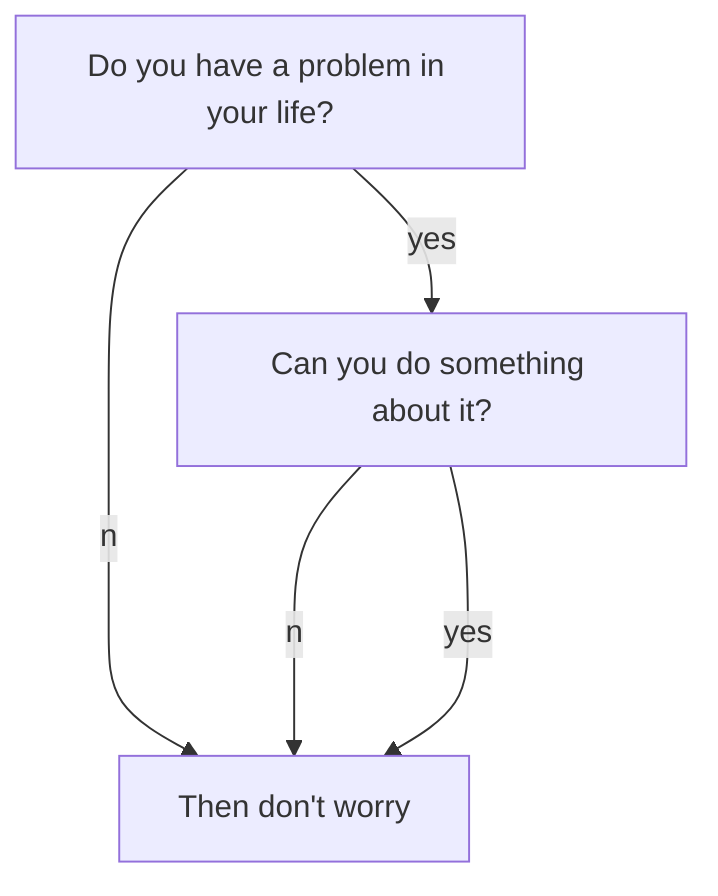

If you see this page, that means you have setup your site. enjoy! :ghost: :ghost: :ghost:

You may want to [config the site](https://tianqi.name/jekyll-TeXt-theme/docs/en/configuration) or [writing a post](https://tianqi.name/jekyll-TeXt-theme/docs/en/writing-posts) next. Please feel free to [create an issue](https://github.com/kitian616/jekyll-TeXt-theme/issues) or [send me email](mailto:kitian616@outlook.com) if you have any questions.

<!--more-->

---

If you like TeXt, don't forget to give me a star. :star2:

[](https://github.com/kitian616/jekyll-TeXt-theme/)

## markdown增强使用
TeXt支持mermaid、mathjax、chart，使用时需要_config.yml (全局)或 YAML 头信息(单一文章)中设置相关的属性为 `true` 来开启对应的功能

```markdown
mermaid: true <!--开启mermaid-->
chart: true <!--开启chart-->
mathjax: true <!--开启mathjax-->
mathjax_autoNumber: true <!--设置公式自动编号-->
```

### 数学公式

When $$a \ne 0$$, there are two solutions to $$ax^2 + bx + c = 0$$ and they are  

$$
x_1 = {-b + \sqrt{b^2-4ac} \over 2a}
$$

$$
x_2 = {-b - \sqrt{b^2-4ac} \over 2a} \notag
$$

```markdown
When $$a \ne 0$$, there are two solutions to $$ax^2 + bx + c = 0$$ and they are  

$$
x_1 = {-b + \sqrt{b^2-4ac} \over 2a}
$$

$$
x_2 = {-b - \sqrt{b^2-4ac} \over 2a} \notag
$$
```
### 流程图测试




```mermaid
chart 
{
  "type": "polarArea",
  "data": {
    "datasets": [
      {
        "data": [
          11,
          16,
          7,
          3,
          14
        ],
        "backgroundColor": [
          "#FF6384",
          "#4BC0C0",
          "#FFCE56",
          "#E7E9ED",
          "#36A2EB"
        ],
        "label": "My dataset"
      }
    ],
    "labels": [
      "Red",
      "Green",
      "Yellow",
      "Grey",
      "Blue"
    ]
  },
  "options": {}
}
```

### Chart测试

```chart
{
  "type": "polarArea",
  "data": {
    "datasets": [
      {
        "data": [
          11,
          16,
          7,
          3,
          14
        ],
        "backgroundColor": [
          "#FF6384",
          "#4BC0C0",
          "#FFCE56",
          "#E7E9ED",
          "#36A2EB"
        ],
        "label": "My dataset"
      }
    ],
    "labels": [
      "Red",
      "Green",
      "Yellow",
      "Grey",
      "Blue"
    ]
  },
  "options": {}
}
```

<div></div>

<div></div>

<div></div>

