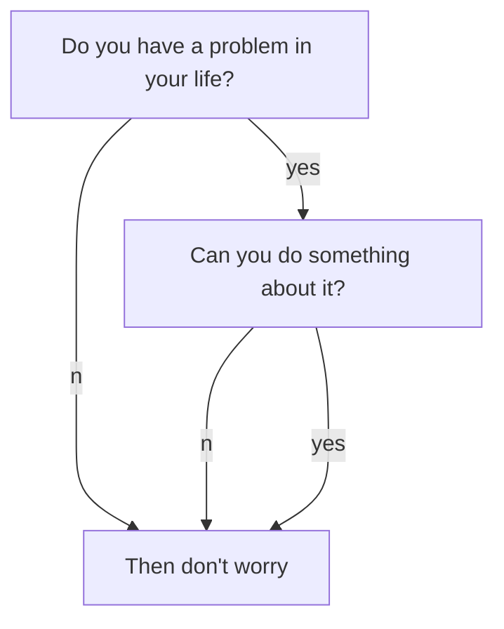

Welcome to [Hexo](https://hexo.io/)! This is your very first post. Check [documentation](https://hexo.io/docs/) for more info. If you get any problems when using Hexo, you can find the answer in [troubleshooting](https://hexo.io/docs/troubleshooting.html) or you can ask me on [GitHub](https://github.com/hexojs/hexo/issues).

## Quick Start

### Create a new post

``` bash
$ hexo new "My New Post"
```

More info: [Writing](https://hexo.io/docs/writing.html)

### Run server

``` bash
$ hexo server
```

More info: [Server](https://hexo.io/docs/server.html)

### Generate static files

``` bash
$ hexo generate
```

```python
def test():
  pass
a = test()
# test coding
```

More info: [Generating](https://hexo.io/docs/generating.html)

### Deploy to remote sites

``` bash
$ hexo deploy
```

### 流程图测试




```mermaid
chart 
{
  "type": "polarArea",
  "data": {
    "datasets": [
      {
        "data": [
          11,
          16,
          7,
          3,
          14
        ],
        "backgroundColor": [
          "#FF6384",
          "#4BC0C0",
          "#FFCE56",
          "#E7E9ED",
          "#36A2EB"
        ],
        "label": "My dataset"
      }
    ],
    "labels": [
      "Red",
      "Green",
      "Yellow",
      "Grey",
      "Blue"
    ]
  },
  "options": {}
}
```
