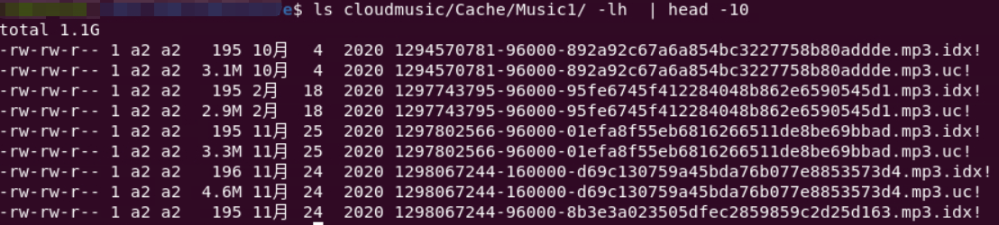
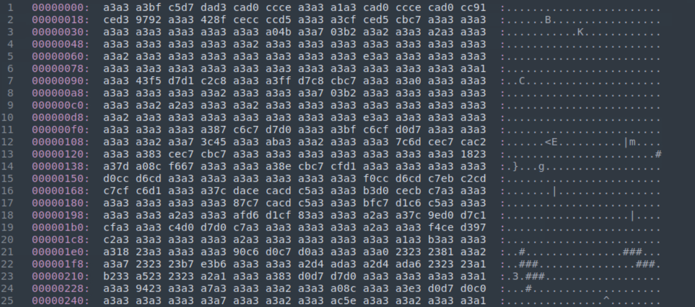
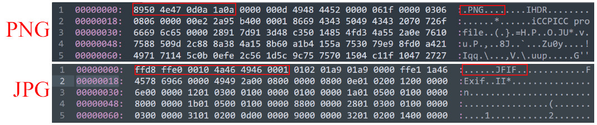
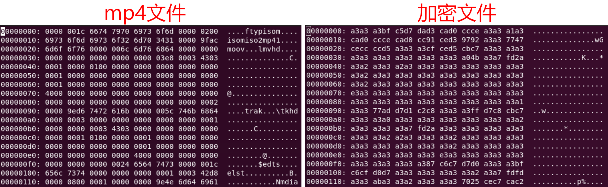

网易云音乐的缓存文件是经过加密的，不能直接播放。出于好奇，对Android端的缓存文件进行十六进制分析，发现其加密方式是按字节与`0xA3`进行异或运算，那么解密则是再将加密后的文件按字节与`0xA2`进行异或运算即可。
<!--more-->
在清理手机文件的时候发现网易云相关文件夹占了相当大的空间，于是仔细看了其中的文件，发现`/netease/cloudmusic/Cache/Music1/`目录占用空间最大，且其下发现了大量命名不知所云，却似乎有规律的文件。文件分两类`mp3.idx!`和`mp3.uc!`，前者文件大小仅有195 Byte，而后者则有MB量级。尝试用文本文件打开这两种文件发现`mp3.idx!`可正确读取，而`mp3.uc!`则是乱码，显然前者是文本文件，后者是二进制文件。



## `mp3.idx!`文件内容分析
以`865861336-96000-57abaa038bfbb2a181acc19c6501bc1a.mp3.idx!`为例。其内容如下，是json格式的内容，其中有歌曲时长(duration)，文件大小(filesize)等字段，从其中可以发现文件命名是使用“歌曲ID”-“歌曲比特率”—“MD5值”三部分组成。根据歌曲ID，在网易云音乐网站可以找到这首歌是：[之间](https://music.163.com/#/song?id=865861336)。检查`mp3.idx!`和`mp3.uc!`的md5值发现二者与其中的md5值都不匹配，那么猜测其中的md5值可能是歌曲原文件的。
```json
{"duration":303078,"filesize":3695704,"musicId":865861336,"filemd5":"57abaa038bfbb2a181acc19c6501bc1a","version":2,"parts":["0,3695704"],"bitrate":96000,"md5":"4b6aedaff80b6e2123d10e193df1415d"}
```
## `mp3.uc!`文件内容分析
以`865861336-96000-57abaa038bfbb2a181acc19c6501bc1a.mp3.idx!`为例。由于这是二进制文件，首先尝试使用媒体播放器打开，可是并不能正常播放，于是尝试用十六进制的形式查看，发现文件看不到常见媒体文件的文件标识符（file signatures）。



### 文件标识符

文件类型的识别方式有两种，一是通过扩展名识别，如图片的格式可以是png、jpg等扩展名；二是根据文件内部数据识别，在文件的特定位置写入若干字节用于表示文件类型，这种文件标识符也被称为魔数（magic numbers），如png格式的魔数十六进制表示是`89 50 4E 47 0D 0A 1A 0A`，jpg格式图片的魔数十六进制表示是`FF D8 FF E0`。



下面是一些常见音视频文件的文件头标识符：

|Hex标识符|ASCII码表示|偏移量|扩展名|描述|
|-|-|-|-|-|
|`49 44 33`|ID3|0|mp3|带有ID3v2容器的MP3文件|
|`52 49 46 46 ?? ?? ?? ?? 57 41 56 45`|RIFF????WAVE|0|wav|波形音频文件|
|`66 74 79 70 69 73 6F 6D`|ftypisom|4|MP4文件|

### 加密方法

回到当前分析的文件。下图是mp4文件和加密文件内容的十六进制显示，mp4文件中有大量的`00`字节，而加密文件中有大量的`A3`字节，根据网上查找到的资料猜测，这里也是采用按字节与`A3`异或运算的方式加密得到的。前表可知，MP4文件中5至12字节的是`6674 7970 6973 6F6D`，而加密文件的5至12字节为：`C5D7 DAD3 CAD0 CCCE`，将其按位与A3异或运算的结果是：`6674 7970 6F6D`，这与MP4文件的标识符相同。由此初步验证猜想，网易云音乐Android客户端的缓存文件也是将源文件按位与A3异或运算生成的。



## 编程验证

前面只是手算验证了部分字节的数据，为了进一步验证该猜想的正确性及其通用性，还需编程验证。程序的基本思路是读取加密文件，并遍历各字节将其与`A3`进行异或运算，再将计算结果写入文件。为了避免生成的音频文件扩展名与其真实类似不匹配，再写文件前，还要根据文件标识符检测文件类型。下面是代码片段：

```python
with open(os.path.join(cache_dir,cache_file),'rb') as f:
                obytes = f.read()
num_bytes = len(obytes)
trans_bytes = []
for i in range(num_bytes):
    trans_bytes.append(obytes[i]^MAGIC_NUM)
ext = filetype.guess_extension(bytes(trans_bytes))
if (not ext):
    # 如果获取ext失败，则使用mp3作为后缀
    # 526216214-160000-688d3e99b5e4576742eb4e54682a4edc.mp3.uc!
    # 天行健-洛天依
    ext = "mp3"
headers={
     'user-agent': 'Mozilla/5.0 (Windows NT 10.0; Win64; x64) AppleWebKit/537.36 (KHTML, like Gecko) Chrome/100.0.4896.127 Safari/537.36'}
song_url = "https://music.163.com/api/song/detail/?id={}&ids=%5B{}%5D".format(song_id,song_id)
"""
存在请求失败的情况，可以选择重复请求若干次，如果不成功则使用id命名
"""
song_name = song_id
artist = ''
try:
    r=requests.get(song_url,headers=headers)
except:
    """
    异常处理，写入log文件
    """
    pass
else:
    try:
        details = r.json()['songs'][0]
    except:
        pass
    else:
        song_name = details['name']
        try:
            artist = details['ar'][0]['name']
        except:
            pass
        if (artist==''):
            try:
                artist = details['artists'][0]['name']
            except:
                pass
        print(song_name + "-" + artist)
opath = os.path.join(save_dir,song_name+"-"+artist+"-"+bits+"."+ext)
with open(opath,'wb') as f:
    f.write(bytes(trans_bytes))

```

这段代码中使用从网易云音乐的API根据加密音乐的ID自动获取歌曲名和歌手名的功能，另外由于加密文件名是中第三部分是歌曲原文件的md5值，因此还可以增加md5的验证功能，以检查解密文件是否正确。

完整代码可查看[github](https://www.github.com) (待上传)

---

**参考**

1. [如何从缓存白嫖网易云音乐 - SegmentFault 思否](https://segmentfault.com/a/1190000022772403)
2. [File format - Wikipedia](https://en.wikipedia.org/wiki/File_format)
3. [List of file signatures - Wikipedia](https://en.wikipedia.org/wiki/List_of_file_signatures)
4. [File Signatures](https://www.garykessler.net/library/file_sigs.html)
