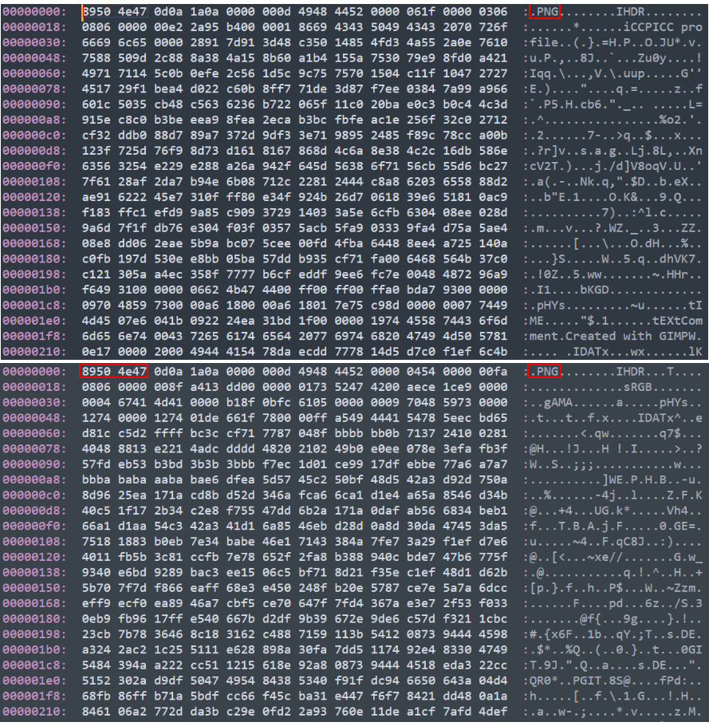

数据以二进制的形式存储在计算机系统内，不同类型的数据有着其独有的特征用于被正确的应用程序识别，这些特征有文件名的扩展名、文件头标识等。
<!--more-->
## 文件扩展名

一般文件名可能有两部分组成如`新建文本文档.txt`，其中`.txt`这个文件名的后缀用于表示文件格式，被称为文件扩展名，常见的扩展名有表示视频文件的`.mp4`、`.avi`，表示音频文件的`.mp3`、`.wav`、表示图像的`.png`、`.jpg`等。

熟悉计算机的人一般很容易通过扩展名来识别文件类型，如`.txt`是文本文件、`.mp3`时音乐文件、`.png`是图像文件。在许多操作内，如Windows，操作系统也是根据扩展名与打开该类型文件的应用程序建立关联的。Windows用户可能会发现，txt文件通常会使用记事本打开，png文件使用图像查看器打开，如果把txt改为png，原来的文本文件也会变成使用图像查看器打开，但其实并不能正常显示内容。因此在Windows系统内修改扩展名时，会有警告提示修改文件扩展名，可能导致文件不可用。

维基百科上有一个较为完整的[文件类型表](https://en.wikipedia.org/wiki/List_of_file_formats)分类列出了各种扩展名及其所代表的文件类型。


## 文件头标志（魔数）

图像查看器不能正常显示文本文件中的内容，记事本打开图像文件也会显示乱码，这是因为二者的编码方式不同。每种类型的文件都有其特有文件编码方式，如在文件的头、尾或其他特定位置设置一定字节的数据用于标识文件类型，通常这些字节会设置在文件头的特定位置，被称为文件文件头标志（file signatures）或魔数（magic numbers, Magic Bytes）。如下图是两个png格式的图像文件用16进制打开后的内容，它们前面部分字节的内容是相同的，这些字节主要用于表示文件格式，后面的字节用于表示每个图像的元数据及图像信息。其中前8个字节的内容都是`8950 4e47 0d0a 1a0a`，这是表示png格式的文件头，其中`50 4e47`是`PNG`的ASCII码。




程序读取文件时通常会先检验文件头的内容，以判断该类型的文件是否为当前程序所支持的文件类型。在维基百科中有详细的[文件头标志列表](https://en.wikipedia.org/wiki/List_of_file_signatures)。

下表是一些常见数据类型的文件头标识，及其对应的扩展名，其中`.`表示不是ASCII字符，`?`表示任意字符。

|Hex标志|ASCII表示|偏移|常用扩展名|说明|
|-|-|-|-|-|
|`377A BCAF 271C`|`7z..'.`|0|.7z|7-zip压缩文件|
|`504b 0304`|PK..|0|.zip|ZIP格式压缩包或基于该格式的文件，如apk、docx、jar等|
|`424c 454e 4445 52`|`BLENDER`|0|.blend|Blender使用的3D文件|
|`213C 6172 6368 3E0A`|`!<arch>.`|0|.deb|Debian软件安装包|
|`4D5A`|`MZ`|0|.exe|Windows应用程序|
|`ffd8 ffe0 0010 4a46 4946`|`......JFIF`|0|.jpg|JPEG图像文件|
|`8950 4e47`|`.PNG`|0|.png|便携式网络图形文件|
|`4944 33`|`ID3`|0|.mp3|有ID3v2标签的MPEG-3音频文件|
|`5249 4646 ???? ???? 5741 5645`|`RIFF????WAVE`|0|.wav|波形音频文件|
|`6674 7970 6973 6F6D`|`ftypisom`|4|.mp4|MPEG-4视频文件|
|`5249 4646 ???? ???? 4156 4920`|`RIFF????AVI.`|0|.avi|音频视频交错格式视频文件|
|`5349 4d50 4c45`|`SIMPLE`|0|.fits|FITS格式图像|
|`7f45 4c46`|`.ELF`|0||Unix可执行文件|
|`3842 5053`|`8BPS`|0|.psd|Photoshop图像编辑文件|

## 媒体类型(MIME)

媒体类型（Multipurpose Internet Mail Extensions, MIME）是一种标准，用来表示文档、文件或字节流的性质和格式。MIME的组成结构非常简单；由类型与子类型两个字符串中间用'/'分隔而组成。不允许空格存在。type 表示可以被分多个子类的独立类别。subtype 表示细分后的每个类型。

```
type/subtype
```

|类型 | 描述 | 典型示例|
|- | -|-|
|text|表明文件是普通文本|text/plain, text/html, text/css, text/javascript|
|image|表明是某种图像|image/gif, image/png, image/jpeg, image/bmp, image/webp, image/x-icon, image/vnd.microsoft.icon|
|audio|表明是某种音频文件|audio/midi, audio/mpeg, audio/webm, audio/ogg, audio/wav|
|video|表明是某种视频文件|video/webm, video/ogg|
|application|表明是某种二进制数据 |application/octet-stream, application/pkcs12, application/vnd.mspowerpoint, application/xhtml+xml, application/xml,  application/pdf|

对于text文件类型若没有特定的subtype，就使用 text/plain。类似的，二进制文件没有特定或已知的 subtype，即使用 application/octet-stream。


## `file`命令与“magic”数据库

`file`命令是Unix系统中常用的查看文件信息，检测文件类型的工具。下面的例子演示了`file`的几种使用方法。

查看文件信息，其中JPEG image data是文件数据类型：
```
$ file d540f4*
d540f4:     JPEG image data, JFIF standard 1.01, aspect ratio, density 1x1, segment length 16, baseline, precision 8, 1280x960, components 3
d540f4.jpg: JPEG image data, JFIF standard 1.01, aspect ratio, density 1x1, segment length 16, baseline, precision 8, 1280x960, components 3
```
查看文件信息但不显示文件名：
```
$ file -b d540f4*
JPEG image data, JFIF standard 1.01, aspect ratio, density 1x1, segment length 16, baseline, precision 8, 1280x960, components 3
JPEG image data, JFIF standard 1.01, aspect ratio, density 1x1, segment length 16, baseline, precision 8, 1280x960, components 3
```
查看文件MIME类型：
```
$ file -i d540f4.jpg
d540f4.jpg: image/jpeg; charset=binary
```
查看文件扩展名：
```
$ file --extension d540f4.jpg
d540f4.jpg: jpeg/jpg/jpe/jfif
```
从上面的例子可以看出，file检测的文件类型与文件的扩展名无关。

`file`是根据“magic”数据库来检测数据类型的，其中存储文件类型的匹配模版。Linux系统中“magic”文件一般在/usr/share/misc/magic.mgc，用户也可以根据需要自定义magic文件，可以参考文章：[Creating a custom magic file database](https://cweiske.de/tagebuch/custom-magic-db.htm)。

---

**参考**

1. [File format - Wikipedia](https://en.wikipedia.org/wiki/File_format)
2. [Filename extension - Wikipedia](https://en.wikipedia.org/wiki/Filename_extension)
3. [MIME - Wikipedia](https://en.wikipedia.org/wiki/MIME)
4. [List of file signatures - Wikipedia](https://en.wikipedia.org/wiki/List_of_file_signatures)
5. [Ian Darwin's Fine Free File Command](http://www.darwinsys.com/file/)
6. [h2non/filetype.py: Small, dependency-free, fast Python package to infer binary file types checking the magic numbers signature](https://github.com/h2non/filetype.py)
7. [Creating a custom magic file database](https://cweiske.de/tagebuch/custom-magic-db.htm)
8. [magic(5): file command's magic pattern file - Linux man page](https://linux.die.net/man/5/magic)
9. [File Signatures](https://www.garykessler.net/library/file_sigs.html)
10. [MIME 类型 - HTTP | MDN](https://developer.mozilla.org/zh-CN/docs/Web/HTTP/Basics_of_HTTP/MIME_types#%E9%80%9A%E7%94%A8%E7%BB%93%E6%9E%84)
