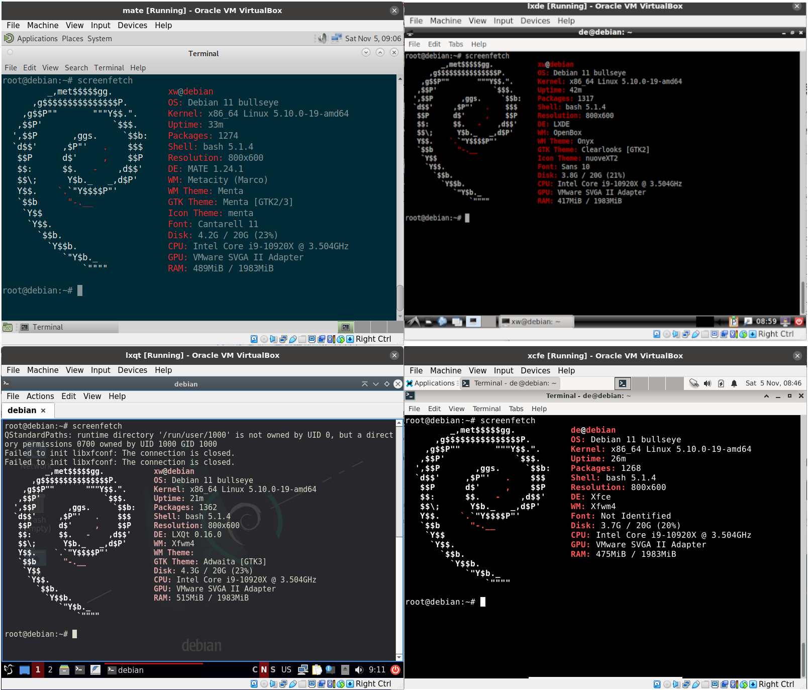

在VirtualBox虚拟机上测试一下xface、lxde、mate、lxqt四种桌面环境效果，对比了其内存、存储空间占用情况。

<!--more-->

测试环境VirtualBox 7.0，创建四台配置相同的虚拟机，系统内存大小2048MB，硬盘大小20GB。测试系统Debian 11，安装过程中除了桌面环境其他配置均保持一致。

查看在仅开启终端的情况下系统内存占用，默认应用程序安装时使用四种桌面的存储空间使用情况：

|桌面|内存|硬盘|
|-|-|-|
|lxde|266M|3.8G|
|xfce|324M|3.7G|
|mate|337M|4.2G|
|lxqt|362M|4.3G|

从上面的结果看占用内存资源最少的是lxde，占用硬盘空间最少的是xfce，但是二者硬盘空占用相差不大，但内存使用相较而言差距明显。lxqt内存使用和硬盘空间占用上都是最高的，但是其UI设计看起来更为现代化。至于mate内存使用略高于xfce，但硬盘占用上要比xfce高了许多。

对现在大多数硬件来说，这几个桌面环境都是相当轻量的，个人认为如果从资用使用的角度来看这几个桌面没有明显差别，可以根据自己的需求和喜欢选择使用。